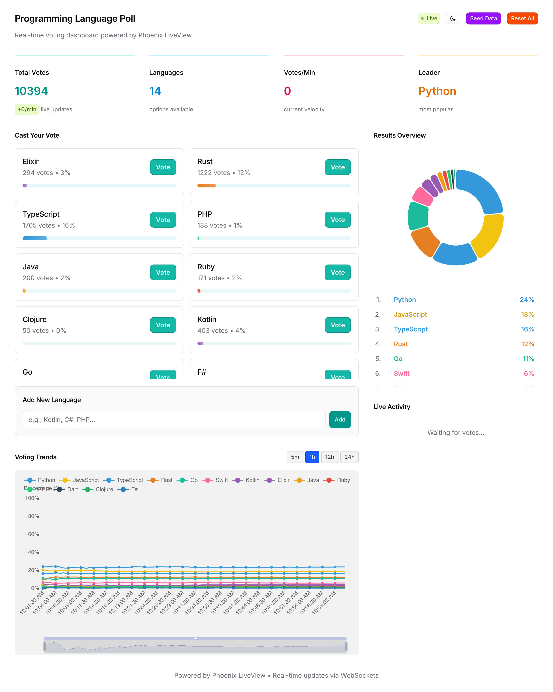
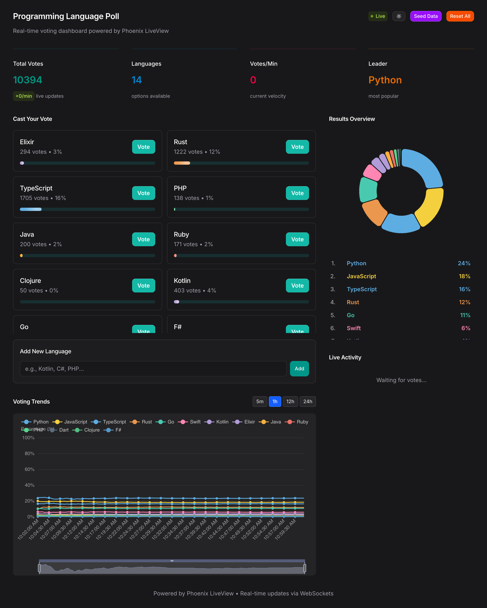
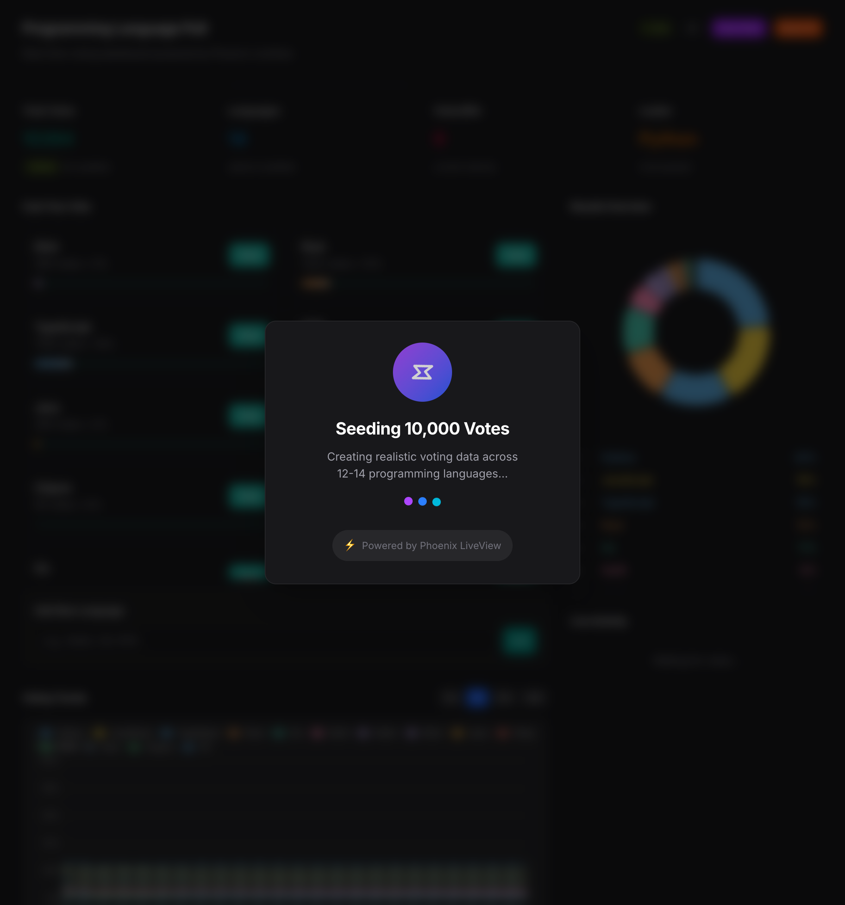
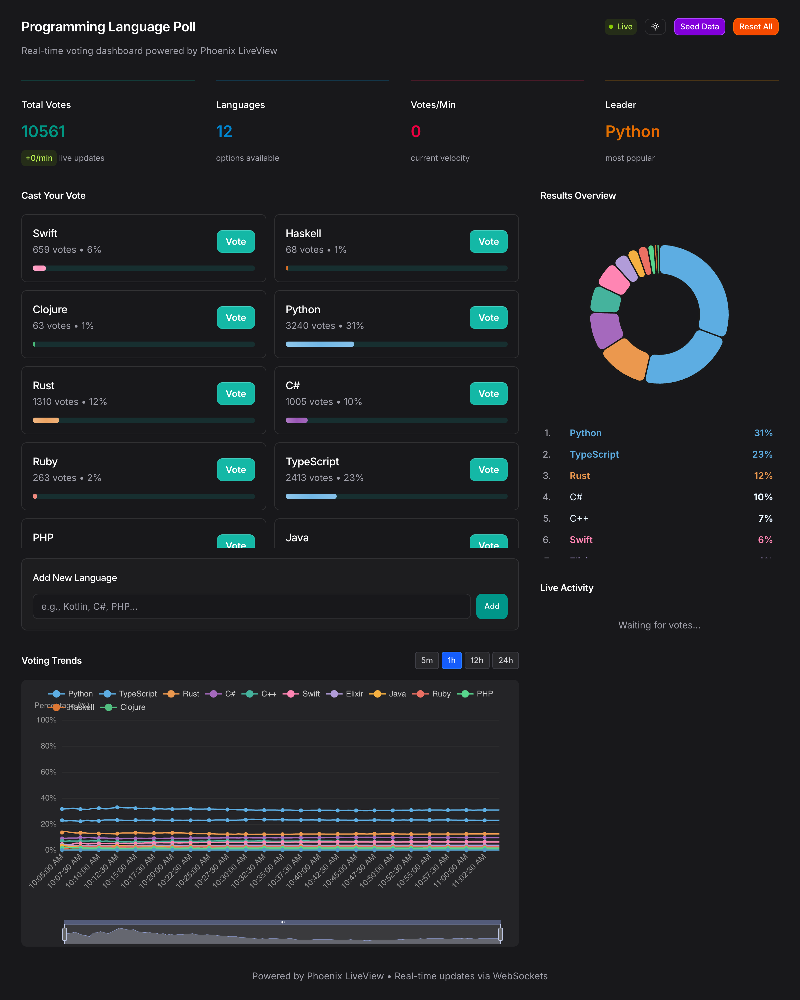

# LivePoll - Real-time Programming Language Poll

A real-time polling application built with Phoenix LiveView to explore and demonstrate Phoenix's powerful real-time capabilities. This project showcases modern web development patterns including WebSocket-based live updates, interactive data visualizations, and elegant UI/UX design.

## 📸 Screenshots

### Light Mode


### Dark Mode


### Seeding Data with Elegant Loading Modal


### Populated Charts with Real Data


## ✨ Features

### Real-time Updates
- **Instant vote synchronization** across all connected clients via Phoenix PubSub
- **Live activity feed** showing recent votes as they happen
- **WebSocket-powered** communication for zero-latency updates
- **Automatic chart updates** when new votes are cast

### Interactive Data Visualizations
- **Professional charts** powered by Apache ECharts
- **Pie chart** showing current vote distribution with interactive legend
- **Trend chart** displaying percentage changes over time
- **Zoom and pan** capabilities on trend charts with state persistence
- **Smooth animations** and transitions

### Time Series Analysis
- **Historical vote tracking** with timestamp-based event storage
- **Multiple time ranges**: 5 minutes, 1 hour, 12 hours, and 24 hours
- **Percentage-based trends** that show relative popularity over time
- **Smart data bucketing** with appropriate intervals for each time range
- **State carry-forward** to show flat lines between votes (realistic trend visualization)

### Data Seeding
- **Realistic data generation** with 10,000 votes across 12-14 programming languages
- **Weighted distribution** reflecting real-world language popularity (2025 trends)
- **Random timestamps** spread across the selected time range
- **Elegant loading modal** with animated spinner and progress indicators
- **Powered by Phoenix LiveView** badge showcasing the framework

### Theme Support
- **Beautiful light and dark modes** with smooth transitions
- **System preference detection** (defaults to user's OS theme)
- **Persistent theme selection** across page reloads
- **Carefully crafted color schemes** for optimal readability

### Modern UI/UX
- **Responsive design** that works on desktop, tablet, and mobile
- **Tailwind CSS v4** for utility-first styling
- **Smooth micro-interactions** (hover effects, button animations)
- **Clean typography** and balanced spacing
- **Accessible** color contrasts and semantic HTML

### Dynamic Language Management
- **Add new languages** on the fly via the UI
- **Vote for any language** with instant feedback
- **Automatic ranking** based on vote counts
- **Live statistics** showing total votes, language count, and current leader

## 🛠 Tech Stack

- **[Phoenix Framework](https://www.phoenixframework.org/)** - Web framework
- **[Phoenix LiveView](https://hexdocs.pm/phoenix_live_view/)** - Real-time server-rendered HTML
- **[Ecto](https://hexdocs.pm/ecto/)** - Database wrapper and query generator
- **[PostgreSQL](https://www.postgresql.org/)** - Database
- **[Apache ECharts](https://echarts.apache.org/)** - Interactive charting library
- **[Tailwind CSS v4](https://tailwindcss.com/)** - Utility-first CSS framework
- **[Phoenix PubSub](https://hexdocs.pm/phoenix_pubsub/)** - Distributed messaging system

## 🚀 Getting Started

### Prerequisites

- Elixir 1.14 or later
- Erlang/OTP 25 or later
- PostgreSQL 14 or later
- Node.js 18 or later (for asset compilation)

### Installation

1. **Clone the repository**
   ```bash
   git clone <repository-url>
   cd live_poll
   ```

2. **Install dependencies**
   ```bash
   mix setup
   ```
   This will:
   - Install Elixir dependencies
   - Install Node.js dependencies
   - Create and migrate the database

3. **Start the Phoenix server**
   ```bash
   mix phx.server
   ```
   Or start it inside IEx for interactive development:
   ```bash
   iex -S mix phx.server
   ```

4. **Visit the application**

   Open your browser and navigate to [`http://localhost:4000`](http://localhost:4000)

## 📖 Usage

### Voting
- Click the **Vote** button next to any programming language
- Watch the charts update in real-time across all connected browsers
- See your vote appear in the live activity feed

### Adding Languages
- Type a language name in the "Add New Language" input field
- Click **Add** to create a new voting option
- The new language appears immediately for all users

### Viewing Trends
- Click the time range buttons (5m, 1h, 12h, 24h) to change the trend view
- Zoom in/out on the trend chart using mouse wheel or pinch gestures
- Pan across the chart by clicking and dragging
- Zoom state persists when switching time ranges

### Seeding Data
- Click **Seed Data** to generate 10,000 realistic votes
- Watch the elegant loading modal with animated spinner
- Charts populate with realistic language popularity distribution
- Data reflects 2025 programming language trends

### Resetting
- Click **Reset All** to clear all votes and languages
- Starts fresh with an empty poll

### Theme Toggle
- Click the theme toggle button in the header
- Switch between light and dark modes
- Theme preference is saved automatically

## 🏗 Architecture Highlights

### LiveView Components
- **PollLive** - Main LiveView module handling all real-time logic
- **Layouts** - Shared layout components with theme support
- **Core Components** - Reusable UI components (buttons, inputs, etc.)

### Database Schema
- **poll_options** - Stores language names and vote counts
- **vote_events** - Time-series event log with timestamps for trend analysis

### JavaScript Hooks
- **PieChart** - ECharts integration for pie chart visualization
- **TrendChart** - ECharts integration for trend line chart with zoom persistence
- **ThemeToggle** - Theme switching with localStorage persistence

### Real-time Features
- **Phoenix PubSub** broadcasts vote events to all connected clients
- **LiveView** automatically updates the DOM when state changes
- **push_event** sends chart data updates to JavaScript hooks
- **phx-update="ignore"** prevents LiveView from touching chart DOM

## 🎯 Learning Objectives

This project demonstrates:

1. **Phoenix LiveView** - Building real-time UIs without writing JavaScript
2. **Ecto** - Database queries, schemas, and migrations
3. **Phoenix PubSub** - Broadcasting messages across processes
4. **JavaScript Interop** - Integrating third-party libraries with LiveView hooks
5. **Time Series Data** - Storing and querying event-based data
6. **Modern CSS** - Tailwind CSS v4 with custom animations
7. **Responsive Design** - Mobile-first approach with Tailwind
8. **State Management** - Managing complex UI state in LiveView

## 📝 License

This project is open source and available for educational purposes.
