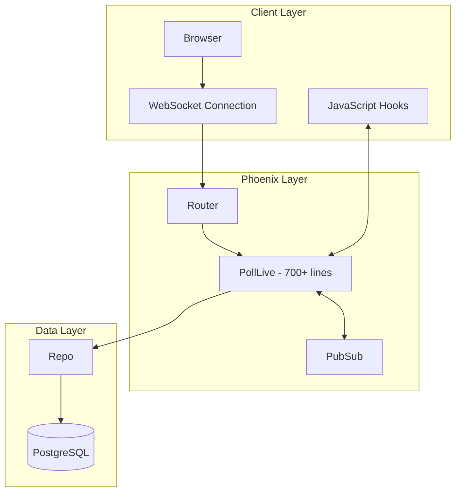
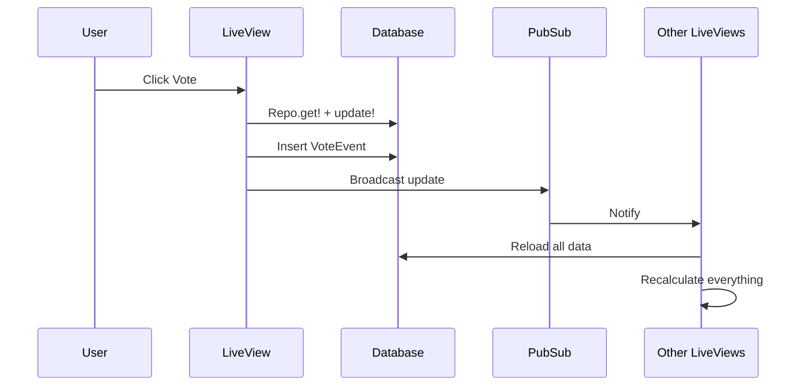
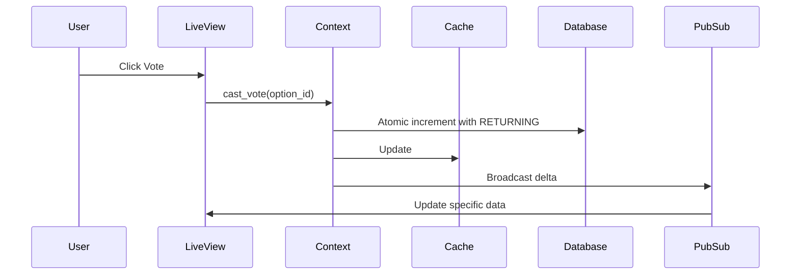
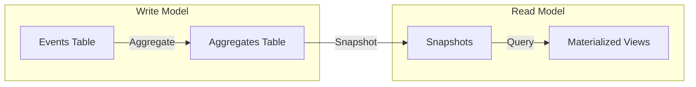
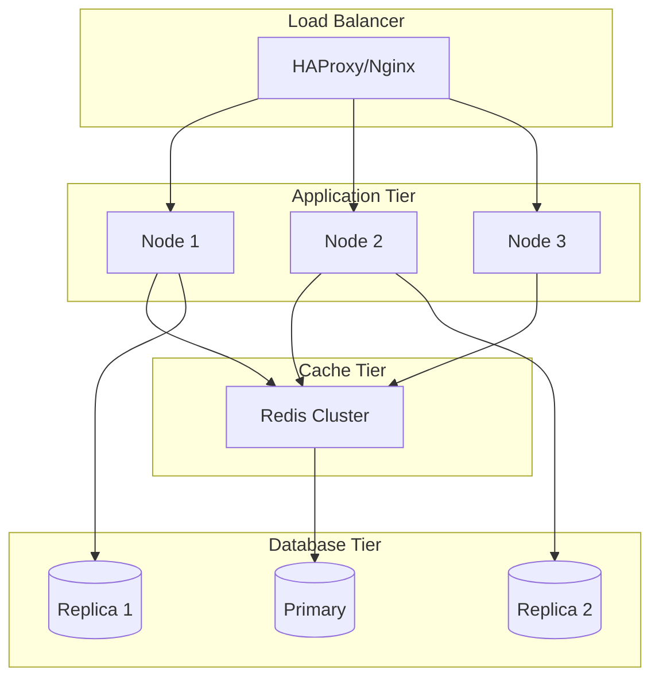

# Architecture & Design Patterns Analysis

## Current Architecture Overview



## Architectural Anti-Patterns

### 1. Missing Business Logic Layer
The application completely lacks a context layer, violating Phoenix's recommended architecture:

**Current Structure:**
```
LiveView → Repo → Database
```

**Should Be:**
```
LiveView → Context → Repo → Database
```

### 2. Monolithic LiveView
`PollLive` handles:
- UI rendering (proper responsibility)
- Business logic (should be in context)
- Data aggregation (should be in query modules)
- Event sourcing (should be in separate module)
- Chart calculations (should be in helpers)
- Seeding logic (should be in seeds/tasks)

### 3. Tight Coupling
Components are tightly coupled with no clear boundaries:
- LiveView directly queries database
- Business rules embedded in UI layer
- No abstraction between layers

## Data Flow Analysis

### Current Vote Flow


**Issues:**
- Each client reloads all data on every update
- No caching or optimization
- Direct database access from LiveView
- Non-atomic vote increments (read-modify-write pattern leads to lost updates under concurrency)

### Proposed Vote Flow


## Time-Series Event System

### Current Implementation
The application implements a custom time-series event system for tracking votes over time:

```elixir
VoteEvent
├── option_id (references)
├── language (denormalized)
├── votes_after (cumulative count)
├── event_type (vote/seed/reset)
└── inserted_at (timestamp)
```

**Problems:**
1. **Denormalization:** `language` field duplicates data from Option
2. **No Partitioning:** All events in single table
3. **No Aggregation Tables:** Calculates trends on-the-fly
4. **Memory Intensive:** Loads all events for calculations
5. **Inefficient Preload:** Unnecessary `preload :option` in trend queries

### Recommended Event Sourcing Pattern


## PubSub Implementation

### Current Issues
1. **Single Topic:** All updates on `"poll:updates"`
2. **Full Reloads:** Broadcasts trigger complete data refresh
3. **No Filtering:** All clients get all updates
4. **No Rate Limiting:** Can overwhelm clients

### Improved PubSub Design
```elixir
defmodule LivePoll.PubSub.Topics do
  def poll_topic(poll_id), do: "poll:#{poll_id}"
  def option_topic(option_id), do: "option:#{option_id}"
  def stats_topic, do: "stats:global"
  def user_topic(user_id), do: "user:#{user_id}"
end

defmodule LivePoll.PubSub.Events do
  defstruct [:type, :payload, :metadata]
  
  def vote_cast(option_id, vote_count) do
    %__MODULE__{
      type: :vote_cast,
      payload: %{option_id: option_id, count: vote_count},
      metadata: %{timestamp: DateTime.utc_now()}
    }
  end
end
```

## Chart Integration Strategy

### Current Approach
Mixed strategy causing confusion:
1. **ECharts:** For pie and trend charts (via hooks)
2. **Manual SVG:** Also for pie charts (server-side)
3. **CSS Charts:** For progress bars

This creates:
- Duplicate rendering logic
- Inconsistent updates
- Maintenance burden
- Unused code (PercentageTrendChart hook duplicates TrendChart)

### Recommended Approach
Single charting strategy:
```javascript
// Centralized chart manager
class ChartManager {
  constructor() {
    this.charts = new Map();
  }
  
  register(id, type, config) {
    const chart = this.createChart(type, config);
    this.charts.set(id, chart);
  }
  
  update(id, data) {
    this.charts.get(id)?.update(data);
  }
  
  dispose(id) {
    this.charts.get(id)?.dispose();
    this.charts.delete(id);
  }
}
```

## Proposed Architecture

### Layer Separation
```
lib/
├── live_poll/
│   ├── polls/                 # Business Logic
│   │   ├── poll.ex            # Poll aggregate
│   │   ├── option.ex          # Option entity
│   │   ├── vote_event.ex      # Event entity
│   │   ├── vote_service.ex    # Voting logic
│   │   ├── trend_analyzer.ex  # Trend calculations
│   │   └── seeder.ex          # Data seeding
│   ├── stats/                 # Statistics
│   │   ├── aggregator.ex      # Real-time aggregation
│   │   ├── calculator.ex      # Calculations
│   │   └── cache.ex           # Caching layer
│   └── events/                # Event Sourcing
│       ├── store.ex           # Event store
│       ├── projector.ex       # Projections
│       └── handler.ex         # Event handlers
│
└── live_poll_web/
    ├── live/
    │   ├── poll_live/
    │   │   ├── index.ex       # Main LiveView
    │   │   ├── components.ex  # UI components
    │   │   └── index.html.heex
    └── channels/
        └── poll_channel.ex    # WebSocket API
```

### Component Architecture
```elixir
defmodule LivePollWeb.PollLive.Components do
  use Phoenix.Component
  
  attr :options, :list, required: true
  attr :total_votes, :integer, default: 0
  
  def vote_chart(assigns) do
    ~H"""
    <div id="vote-chart" phx-hook="VoteChart" data-options={@options}>
      <!-- Chart renders here -->
    </div>
    """
  end
  
  attr :trend_data, :list, required: true
  attr :time_range, :integer, default: 60
  
  def trend_chart(assigns) do
    ~H"""
    <div id="trend-chart" phx-hook="TrendChart" 
         data-trends={@trend_data}
         data-range={@time_range}>
      <!-- Trend chart renders here -->
    </div>
    """
  end
end
```

### Context Design
```elixir
defmodule LivePoll.Polls do
  @moduledoc """
  The Polls context - handles all voting business logic
  """
  
  alias LivePoll.Polls.{Option, VoteEvent, VoteService, TrendAnalyzer}
  
  # Public API
  def list_options, do: # ...
  def cast_vote(option_id), do: # ...
  def get_trends(time_range), do: # ...
  def reset_all_votes, do: # ...
  def seed_votes(count), do: # ...
  
  # Delegated to services
  defdelegate calculate_percentages(options), to: VoteService
  defdelegate analyze_trends(events, range), to: TrendAnalyzer
end
```

### Caching Strategy
```elixir
defmodule LivePoll.Stats.Cache do
  use GenServer
  
  @refresh_interval :timer.seconds(5)
  
  def start_link(opts) do
    GenServer.start_link(__MODULE__, opts, name: __MODULE__)
  end
  
  def get_stats do
    GenServer.call(__MODULE__, :get_stats)
  end
  
  def init(_opts) do
    schedule_refresh()
    {:ok, %{stats: nil, last_updated: nil}}
  end
  
  def handle_info(:refresh, state) do
    stats = calculate_stats()
    schedule_refresh()
    {:noreply, %{state | stats: stats, last_updated: DateTime.utc_now()}}
  end
end
```

## Database Schema Improvements

### Current Schema Issues
1. No foreign key constraints on cascade delete
2. Missing compound indexes
3. No partitioning for time-series data
4. Denormalized data
5. Missing unique constraint on poll_options(text)

### Improved Schema
```sql
-- Add unique constraint
CREATE UNIQUE INDEX poll_options_text_unique ON poll_options(text);

-- Partitioned events table
CREATE TABLE vote_events (
    id BIGSERIAL,
    option_id BIGINT NOT NULL,
    votes_after INTEGER NOT NULL,
    event_type VARCHAR(20) NOT NULL,
    created_at TIMESTAMPTZ NOT NULL,
    PRIMARY KEY (id, created_at)
) PARTITION BY RANGE (created_at);

-- Create partitions
CREATE TABLE vote_events_2025_10 PARTITION OF vote_events
    FOR VALUES FROM ('2025-10-01') TO ('2025-11-01');

-- Materialized view for trends
CREATE MATERIALIZED VIEW hourly_trends AS
SELECT 
    date_trunc('hour', created_at) as hour,
    option_id,
    MAX(votes_after) as votes
FROM vote_events
GROUP BY hour, option_id;

-- Indexes
CREATE INDEX idx_vote_events_option_time 
    ON vote_events(option_id, created_at DESC);
CREATE INDEX idx_vote_events_type_time 
    ON vote_events(event_type, created_at DESC);
```

## Performance Optimizations

### Query Optimization
```elixir
# Current: Load all events
events = Repo.all(from e in VoteEvent, 
  where: e.inserted_at >= ^cutoff_time,
  preload: :option)  # Unnecessary preload

# Optimized: Aggregate in database
trends = Repo.all(
  from e in VoteEvent,
  where: e.inserted_at >= ^cutoff_time,
  group_by: [
    fragment("date_trunc('minute', ?)", e.inserted_at),
    e.option_id
  ],
  select: %{
    time: fragment("date_trunc('minute', ?)", e.inserted_at),
    option_id: e.option_id,
    votes: max(e.votes_after)
  }
)
```

### Atomic Vote Increments
```elixir
# Current: Race condition with read-modify-write
option = Repo.get!(Option, id)
{:ok, updated_option} = option
  |> Ecto.Changeset.change(votes: option.votes + 1)
  |> Repo.update()

# Fixed: Atomic increment with RETURNING
{1, [updated_option]} = 
  from(o in Option, where: o.id == ^id, select: o)
  |> Repo.update_all([inc: [votes: 1]], returning: true)
```

### LiveView Optimization
```elixir
# Use streams for large collections
def mount(_params, _session, socket) do
  {:ok, 
   socket
   |> stream(:options, Polls.list_options())
   |> stream(:recent_activity, [])}
end

# Selective updates
def handle_info({:vote_update, %{option_id: id, votes: votes}}, socket) do
  {:noreply,
   stream_insert(socket, :options, 
     Polls.get_option!(id), at: -1)}
end
```

## Scalability Considerations

### Horizontal Scaling
Current architecture prevents horizontal scaling:
- In-memory state in LiveView
- No session affinity handling
- Direct database access

### Recommended Scaling Architecture


## Project Guideline Compliance

### Current Violations
1. **Inline Scripts:** Theme toggle script in root.html.heex (should be in assets/js)
2. **Flash Group Misuse:** `<Layouts.flash_group>` called outside layouts module
3. **Missing Layout Wrapper:** LiveView template not wrapped with `<Layouts.app>`
4. **Form Patterns:** Not using `to_form` + `<.form>` + `<.input>` for Add Language form
5. **DaisyUI Usage:** Contrary to project guidance preferring Tailwind-only custom components

### Fixes Required
```elixir
# Wrap template properly
~H"""
<Layouts.app flash={@flash}>
  <!-- Poll content here -->
</Layouts.app>
"""

# Use proper form components
def render(assigns) do
  ~H"""
  <.form for={@form} id="language-form" phx-submit="add_language">
    <.input field={@form[:name]} type="text" placeholder="Language name" />
    <.button type="submit">Add</.button>
  </.form>
  """
end
```

## Conclusion

The current architecture suffers from fundamental design issues that limit scalability, maintainability, and testability. The monolithic LiveView and missing business logic layer are the most critical problems. A proper refactoring following Phoenix conventions and SOLID principles would significantly improve the application's quality and maintainability.

Key improvements needed:
1. Extract business logic to context modules
2. Implement atomic vote increments to prevent concurrency issues
3. Add unique constraints and proper indexes
4. Remove unnecessary preloads and optimize queries
5. Fix project guideline violations
6. Implement proper caching and aggregation strategies
7. Clean up duplicate chart rendering code