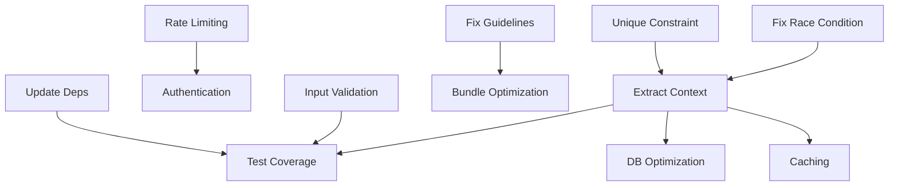

# LivePoll Implementation Plan

## Overview
This directory contains the comprehensive implementation plan addressing all issues identified in the code review conducted on October 25, 2025. The plan is organized into individual task files, each providing detailed implementation instructions, code examples, and acceptance criteria.

## Task Summary

### 🔴 CRITICAL Priority (Immediate Action Required)
1. **[001-fix-race-condition-voting.md](001-fix-race-condition-voting.md)** - Fix race condition in vote counting (30 min)
2. **[002-implement-rate-limiting.md](002-implement-rate-limiting.md)** - Add rate limiting to prevent DoS (2-4 hours)
3. **[003-add-unique-constraint-languages.md](003-add-unique-constraint-languages.md)** - Add database constraint for duplicates (1-2 hours)
8. **[008-add-authentication-authorization.md](008-add-authentication-authorization.md)** - Protect admin functions (4-6 hours)

### 🟠 HIGH Priority (Complete within 1 week)
4. **[004-extract-polls-context.md](004-extract-polls-context.md)** - Extract business logic to context module (1-2 days)
5. **[005-optimize-seeding-performance.md](005-optimize-seeding-performance.md)** - Optimize batch inserts for seeding (2-4 hours)
6. **[006-fix-project-guideline-violations.md](006-fix-project-guideline-violations.md)** - Fix Phoenix 1.8 compliance issues (3-4 hours)
7. **[007-add-input-validation-sanitization.md](007-add-input-validation-sanitization.md)** - Add comprehensive validation (3-4 hours)

### 🟡 MEDIUM Priority (Complete within 1 month)
9. **[009-improve-test-coverage.md](009-improve-test-coverage.md)** - Increase test coverage to 80%+ (2-3 days)
10. **[010-optimize-database-queries.md](010-optimize-database-queries.md)** - Add indexes and optimize queries (4-6 hours)
11. **[011-remove-daisyui-optimize-bundle.md](011-remove-daisyui-optimize-bundle.md)** - Remove unused CSS and optimize JS (3-4 hours)
12. **[012-implement-caching-strategy.md](012-implement-caching-strategy.md)** - Add ETS/Cachex caching layer (4-6 hours)
13. **[013-update-dependencies.md](013-update-dependencies.md)** - Update to latest stable versions (1-2 hours)

## Implementation Phases

### Phase 1: Critical Security & Stability (Days 1-2)
**Goal:** Make application safe for limited production use

#### Day 1 - Data Integrity & Security
- [ ] Task 001: Fix race condition (30 min)
- [ ] Task 003: Add unique constraint (1 hour)
- [ ] Task 002: Implement rate limiting (3 hours)

#### Day 2 - Access Control
- [ ] Task 008: Add authentication (4 hours)
- [ ] Task 007: Input validation (3 hours)

### Phase 2: Architecture & Performance (Week 1)
**Goal:** Improve maintainability and performance

#### Days 3-4 - Refactoring
- [ ] Task 004: Extract context module (1.5 days)
- [ ] Task 006: Fix guideline violations (3 hours)

#### Day 5 - Performance
- [ ] Task 005: Optimize seeding (2 hours)
- [ ] Task 010: Database optimization (4 hours)

### Phase 3: Quality & Testing (Week 2)
**Goal:** Ensure code quality and reliability

#### Days 6-8 - Testing
- [ ] Task 009: Comprehensive test suite (2 days)
- [ ] Task 013: Update dependencies (1 hour)

#### Days 9-10 - Optimization
- [ ] Task 011: Bundle optimization (3 hours)
- [ ] Task 012: Implement caching (5 hours)

## Task Dependencies



## Success Metrics

### Technical KPIs
- ✅ Zero race conditions
- ✅ Test coverage >80%
- ✅ Response time <100ms (p95)
- ✅ Bundle size <400KB
- ✅ Zero critical security vulnerabilities
- ✅ All Phoenix 1.8 guidelines followed

### Business KPIs
- ✅ Support 5000+ concurrent users
- ✅ Handle 100,000+ votes/hour
- ✅ 99.9% uptime
- ✅ <2 second page load time

## Estimated Total Effort
- **Critical Tasks:** 1-2 days
- **High Priority:** 3-4 days
- **Medium Priority:** 4-5 days
- **Total:** ~10-12 developer days

## Quick Start

### For Immediate Production Safety
```bash
# Start with critical fixes
git checkout -b fix/critical-issues
# Implement tasks 001, 002, 003
mix test
mix format
git commit -m "Fix critical security and data integrity issues"
```

### For Full Implementation
```bash
# Follow the phases in order
git checkout -b refactor/complete-implementation
# Implement all tasks following the roadmap
mix precommit  # As per AGENTS.md
git commit -m "Complete implementation of all review recommendations"
```

## Testing Each Task
Every task includes:
- Specific testing instructions
- Expected performance improvements
- Quality check criteria
- Rollback procedures if needed

## Notes
- Each task is self-contained with all needed information
- Tasks can be assigned to different developers
- Priority order should be respected for dependencies
- Use branch naming conventions specified in each task
- Run `mix precommit` before committing (per project guidelines)

## Review Checklist
Before considering the implementation complete:

- [ ] All CRITICAL tasks completed
- [ ] All HIGH priority tasks completed
- [ ] Test coverage >80%
- [ ] No security vulnerabilities (mix deps.audit)
- [ ] Performance targets met
- [ ] Documentation updated
- [ ] CI/CD pipeline green
- [ ] Code review completed

---

Generated from comprehensive code review conducted on October 25, 2025.
Based on analysis from multiple AI models and validated against Phoenix best practices.
